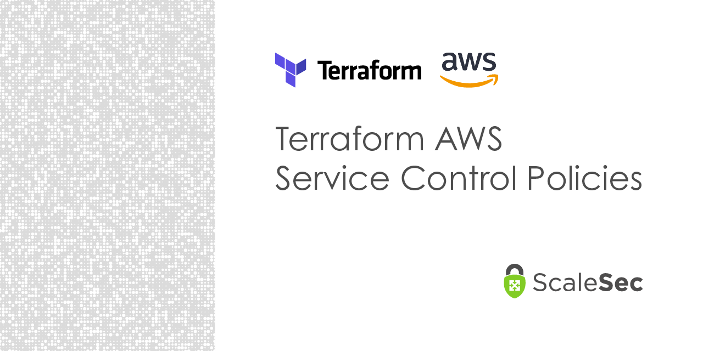
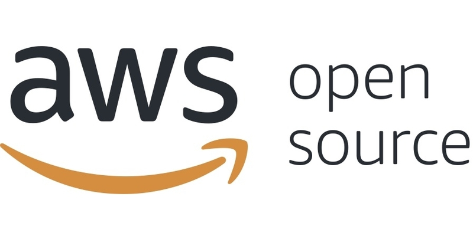

# Welcome to Jason Dyke's GitHub!

This README represents an example of my public repositories that I either authored or co-contributed to. A lot of the projects I have worked on in the past 2 years as a consultant are stuck behind IP agreements, but I hope you find some of these useful in your day to day!

## :construction_worker: Workload Identity Federation :construction_worker:
[!Workload Identity Fedederation](./img/aws-to-gcp.png)(https://github.com/ScaleSec/gcp-workload-identity-federation)

This repository contains a python module that allows users to access GCP from AWS without the use of static credentials (aka GCP service account keys). This module can be imported into any python script and leveraged to generate an ephemeral GCP service account access token.

## :lock: Project Lockdown :lock:

Project Lockdown is a collection of automated remediation Cloud Functions designed to react to unsecure resource creations or configurations. Project Lockdown is meant to be deployed in a GCP environment and has the capabilities to monitor and remediate across your entire Organization hierarchy in a matter of seconds.

## :robot: GCP Organization Policy Bot :robot:

The GCP Organization Policy bot is a 100% serverless tool that analyzes GCP Organization Policies for updates and then posts to a slack channel as well as the Twitter handle [@gcporgpolicybot](https://twitter.com/gcporgpolicybot).

## :cloud: Terraform AWS Service Control Policy Suite :cloud:

This repo is a collection of AWS Service Control Policies (SCPs) written in Hashicorp Terraform. Areas of coverage include AWS best practices and compliance frameworks such a ISO, SOC, PCI, HIPAA, and FedRAMP.

## :man_dancing: GCP Service Account Lister :man_dancing:

This script crawls your GCP Organization and returns service accounts that have not been used in the past 90 days based on GCP Recommender Service Account Insight [findings](https://cloud.google.com/iam/docs/managing-insights).

## :key: GCP API Key Lister :key:

This script will inventory your entire GCP Organization's API keys and create two files: `key_dump.json` and `keys.csv` that contain all of your API keys. 

## :detective: GCP Event Threat Detection Remediator :detective:

This repo contains all you need to begin automating remediations for GCP Event Threat Detection findings.

## :framed_picture:	AWS Compliance SCP Lister :framed_picture:

I was a co-contributor on this repository providing guidance and quality assurance testing. This repo automatically compiles an AWS Service Control Policy that ONLY allows AWS services that are compliant with your preferred compliance frameworks.
